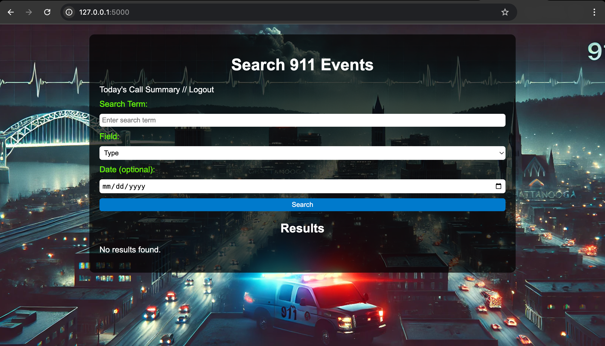

# HC911-App

HC911-App is a web application designed to search your local hc911 database that you created using https://github.com/DC423/HC911-Data. Built using Python and HTML, it leverages Flask to create a responsive, user-friendly interface for searching the database for events, as well as a summary of todays calls so you can see trends over time. Eventually it could be done to make a page that looks at a year at a time, but I do not have a need for that at this time.

## Features

- User Interface: HTML templates for responsive design
- Python-Driven Logic: Core backend functionality in app.py
- Template-Based Rendering: Organized in the /templates folder

## Getting Started

## Prerequisites

Python 3.x
Flask (if used; install via pip install flask)

## Installation

### Clone this repository:

```
git clone https://github.com/DC423/HC911-App.git
cd HC911-App
```


### Install dependencies:

```
pip install flask python-dotenv
```

### Edit Files and get hc911.db

```
Ensure you have hc911.db locally, also change anything you want to change such as background image
```

### Run the application:

```
python -m app
```


Visit http://127.0.0.1:5000 in your browser to access the app.

It should look like this


# Project Structure

app.py: Main application file, manages routing and logic.

templates/: Folder for HTML templates to render the app’s frontend.

# Contributing
1) Fork the repository.
2) Create a new branch: git checkout -b feature-branch
3) Commit changes: git commit -m "Added feature"
4) Push to the branch: git push origin feature-branch
5) Submit a pull request.

# License

This project is licensed under the MIT License. See LICENSE for more details.


